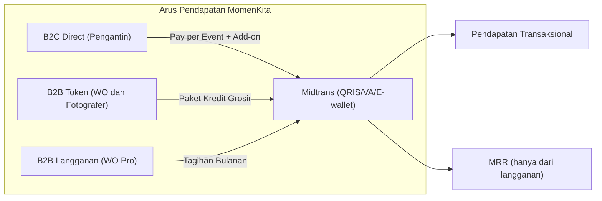
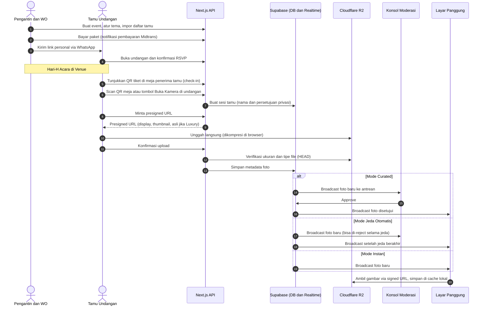
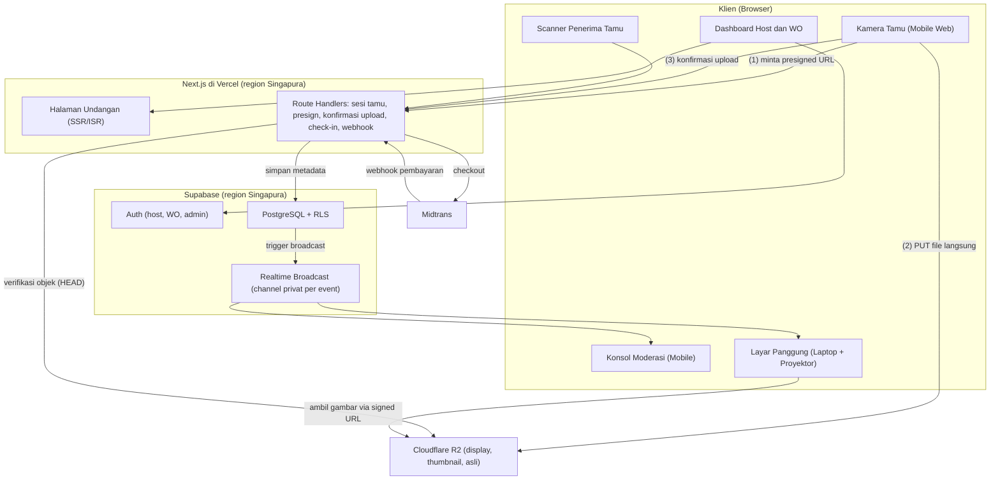
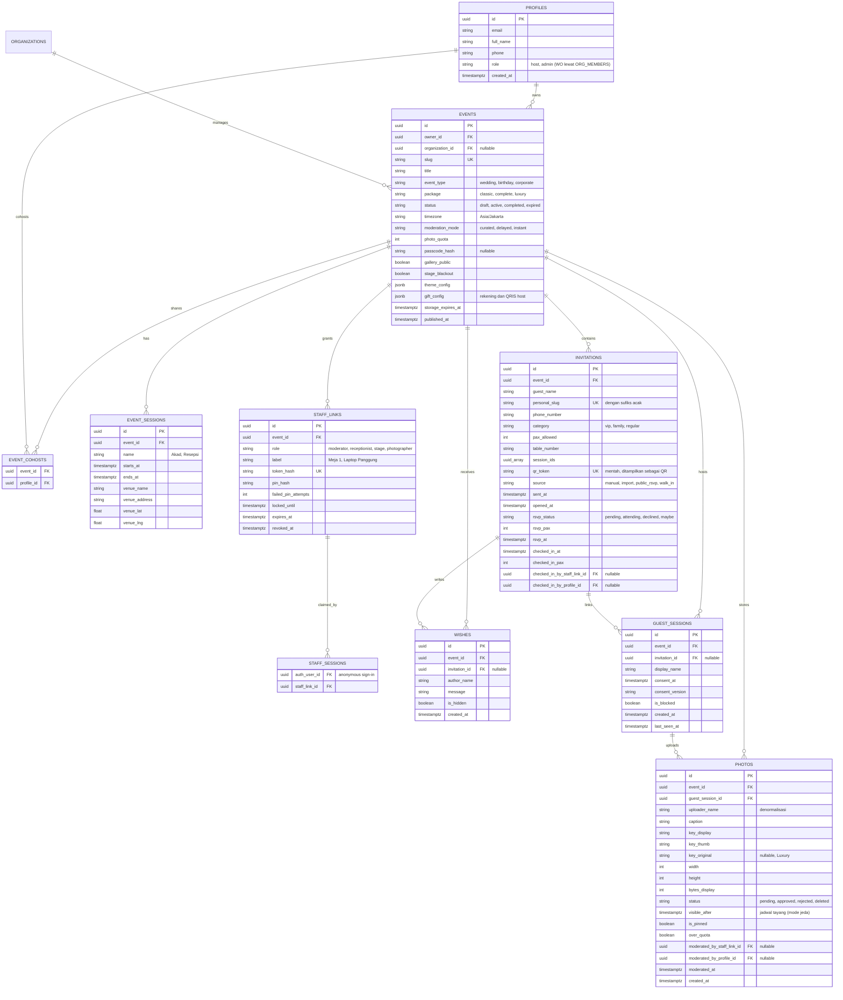
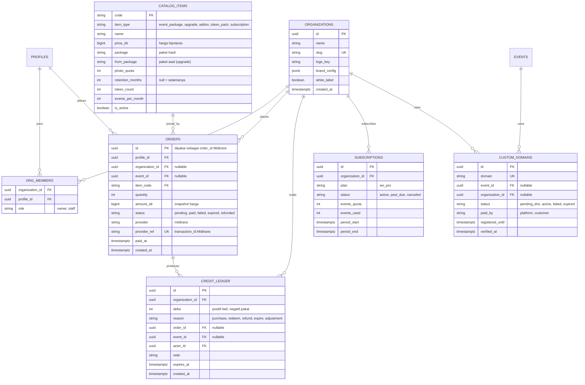
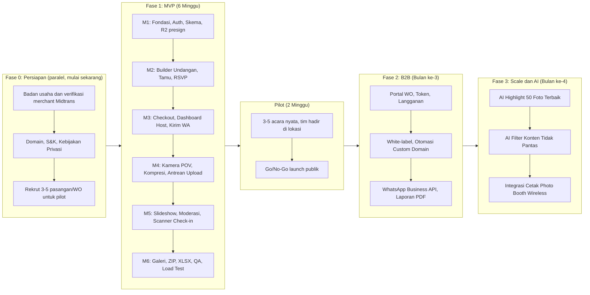

# Product Requirements Document (PRD)
# Platform: MomenKita (All-in-One Digital Invitation & Live Event Experience SaaS)

**Versi Dokumen:** 1.4.0
**Tanggal:** 26 September 2026
**Status:** Draft. 6 dari 8 keputusan sudah diambil ([Bagian 14](#14-pertanyaan-terbuka--keputusan-yang-dibutuhkan)). Dua keputusan yang ditunda (badan usaha dan domain) tidak menghambat pengembangan, tetapi wajib selesai sebelum launch publik.
**Penulis Awal:** AI Product Strategy Specialist & Pair Architect
**Revisi:** Claude (Opus 5.5)
**Product Owner:** _(belum ditentukan)_

---

## 0. Riwayat Revisi

| Versi | Tanggal | Ringkasan |
| :--- | :--- | :--- |
| 1.0.1 | 26 Sep 2026 | Draft awal (arsip: [`archive/PRD_Event_Experience_SaaS_v1.0.1.md`](archive/PRD_Event_Experience_SaaS_v1.0.1.md)) |
| 1.1.0 | 26 Sep 2026 | Kontradiksi internal diperbaiki, skema database dilengkapi, risiko teknis ditangani, dan kriteria penerimaan, kepatuhan, serta risiko ditambahkan |
| 1.2.0 | 26 Sep 2026 | Keputusan Product Owner diterapkan: Midtrans sebagai payment gateway, harga ditetapkan sebagai hipotesis, batas file asli 10 MB, tanpa unggah dari galeri HP, moderasi default Curated, video ditunda ([§14](#14-pertanyaan-terbuka--keputusan-yang-dibutuhkan)) |
| 1.3.0 | 26 Sep 2026 | §7 diselaraskan dengan migrasi SQL: tabel `event_cohosts`, `staff_sessions`, dan `catalog_items` ditambahkan; `qr_token` disimpan mentah; §7.4 Model Akses ditambahkan ([§7](#7-skema-basis-data)) |
| 1.4.0 | 26 Sep 2026 | §5.3 dan §6.2 disesuaikan dengan implementasi kamera: fallback JPEG untuk browser tanpa encoder WebP (Safari), kompresi sendiri tanpa library demi anggaran JS ≤150KB |

### Perubahan utama di v1.1.0

| # | Masalah di v1.0.1 | Perbaikan di v1.1.0 |
| :--- | :--- | :--- |
| 1 | "Download Full RAW ZIP" tidak mungkin karena semua foto dikompresi ke WebP sebelum diunggah. | Diganti menjadi **"Unduh Kualitas Asli"**: paket Luxury juga mengunggah file asli di latar belakang ([§5.3](#53-modul-3-guest-pov-camera-web-tanpa-unduh)). |
| 2 | QR Check-in dijual di paket flagship, tetapi baru dibangun di Fase 2. | Scanner check-in berbasis web dipindah ke **MVP (Fase 1)** ([§10](#10-rencana-rilis-roadmap)). |
| 3 | WO Pro (Rp 1,49jt untuk 10 event = Rp 149rb/event) lebih murah daripada kredit grosir dan mengkanibal paket kredit. | WO Pro menjadi **5 event/bulan (Rp 298rb/event)** plus white-label; tambahan event Rp 249rb ([§3.3](#33-paket-kemitraan-b2b-wedding-organizer--studio)). |
| 4 | K-Factor > 1.2 didefinisikan sebagai "1 event → 1 pendaftar" (itu K = 1,0), dan istilah "MRR" dipakai untuk pay-per-event. | Definisi KPI dikoreksi dan dibuat terukur ([§11](#11-indikator-keberhasilan-kpi)). |
| 5 | Skema DB tidak memuat RSVP, kategori tamu, pembayaran, kredit, organisasi WO, sesi tamu, atau peran staf. | Skema ditulis ulang ([§7](#7-skema-basis-data)). |
| 6 | Tidak ada mekanisme presigned URL, rate limit, antrean upload offline, pembuatan thumbnail, maupun strategi ZIP besar. | Ditambahkan ke arsitektur ([§6](#6-arsitektur-teknologi)). |
| 7 | `getUserMedia` bermasalah di in-app browser WhatsApp/Instagram. | Kamera **hibrida**: viewfinder web dengan fallback ke kamera native ([§5.3](#53-modul-3-guest-pov-camera-web-tanpa-unduh)). |
| 8 | Target "OPEX ≈ 0" bertentangan dengan kebutuhan keandalan hari-H (Vercel Hobby dilarang untuk komersial, Supabase Free bisa di-pause). | Anggaran infrastruktur minimum dibuat realistis ([§3.5](#35-estimasi-biaya-operasional-opex)). |
| 9 | Kuota 1.000 foto bisa habis di tengah acara tanpa aturan yang jelas. | **Soft limit**: kamera tidak pernah diblokir saat hari-H ([§3.4](#34-kebijakan-paket)). |
| 10 | Timeline 4 minggu tanpa QA, uji beban, maupun uji coba lapangan. | MVP 6 minggu, ditambah **pilot 2 minggu** di acara nyata ([§10](#10-rencana-rilis-roadmap)). |
| 11 | UU PDP, status angpao, risiko WhatsApp Blast, dan kepemilikan custom domain belum dibahas. | Bagian baru: [§9 Privasi, Keamanan & Kepatuhan](#9-privasi-keamanan--kepatuhan-baru). |
| 12 | Link personal `.../to/Bapak-Rudi` mudah ditebak, sehingga daftar tamu bisa dienumerasi. | Slug personal diberi sufiks acak ([§5.1](#51-modul-1-undangan-web-interaktif--rsvp)). |
| 13 | Acara dengan beberapa sesi (akad dan resepsi di waktu/lokasi berbeda) tidak didukung. | Tabel `event_sessions` ditambahkan ([§7](#7-skema-basis-data)). |

---

## 1. Executive Summary & Visi Produk

### 1.1 Latar Belakang
Pasar undangan digital sudah menjadi *red ocean*: penyedia bersaing harga dengan halaman web statis murah (Rp 20.000 – Rp 50.000). Di sisi lain, pernikahan dan acara modern makin mementingkan **pengalaman tamu (*guest experience*)** dan **dokumentasi candid otentik** dari sudut pandang tamu (*Point of View / POV*), seperti terlihat dari popularitas *Satualbum.id*, *Wedbox*, dan kamera *disposable*.

### 1.2 Pernyataan Visi Produk
**MomenKita** adalah platform SaaS *all-in-one event experience* yang menggabungkan:
1. **Pre-Event:** Undangan digital interaktif dan manajemen RSVP.
2. **Reception Desk:** Buku tamu digital berbasis QR Code check-in.
3. **During Event:** Kamera POV tamu instan (*zero-install mobile web*) yang tersinkronisasi ke album bersama.
4. **Stage Entertainment:** *Live Slideshow* di layar LED / proyektor panggung dengan moderasi *real-time*.
5. **Post-Event:** Galeri bersama, unduhan album dalam format ZIP, dan laporan buku tamu.

### 1.3 Unique Value Proposition (UVP)
* **Bagi Pengantin/Tuan Rumah:** Tidak sekadar menyebar undangan, tetapi juga mendapatkan ratusan foto candid otentik dan memeriahkan pesta tanpa biaya fotografer tambahan.
* **Bagi Tamu:** Pengalaman seru tanpa perlu mengunduh aplikasi; cukup scan QR di meja.
* **Bagi Wedding Organizer (WO) & Vendor:** Layanan premium tambahan dengan sistem *white-label*. WO bebas menentukan harga jual ke kliennya, sehingga selisihnya menjadi margin WO.

### 1.4 Prinsip Produk (Baru)
Prinsip-prinsip ini dipakai sebagai penentu saat ada trade-off desain:
1. **Hari-H tidak boleh gagal.** Keandalan saat acara berlangsung lebih penting daripada fitur baru. Setiap fitur hari-H wajib punya mode degradasi (offline, fallback).
2. **Tamu tanpa friksi.** Tidak ada registrasi akun, tidak ada unduh aplikasi, dan tidak lebih dari satu isian (nama).
3. **Host memegang kendali.** Semua konten yang tampil di depan umum bisa dihentikan dalam satu ketukan.
4. **Jangan pernah memblokir kamera tamu di tengah acara**, termasuk ketika kuota habis.

---

## 2. Target Persona, Stakeholder & Peran

### 2.1 Persona

| Persona | Peran | Kebutuhan Utama | Titik Sakit |
| :--- | :--- | :--- | :--- |
| **Calon Pengantin (B2C Host)** | Pengambil keputusan utama dan pembayar | Acara berkesan, tamu merasa terlibat, foto candid terkumpul rapi di satu tempat. | Foto candid tamu tercecer di WhatsApp/Instagram Story yang hilang setelah 24 jam. |
| **Tamu Undangan (Guest)** | Pengguna akhir kamera POV | Mudah diakses, tanpa registrasi, ingin fotonya tampil di layar. | Malas mengunduh aplikasi baru dan registrasi email/password. |
| **Wedding Organizer (B2B Partner)** | Operator acara dan reseller | Check-in cepat tanpa antrean, kontrol penuh atas foto yang tayang di panggung. | Khawatir foto yang tidak pantas tayang di depan keluarga besar. |
| **Panitia Penerima Tamu** *(baru)* | Operator meja resepsi di hari-H | Scan cepat, tahu nomor meja tamu, tetap bisa bekerja saat sinyal jelek. | Sering kerabat yang tidak melek teknologi; tidak punya akun. |
| **Fotografer / Dokumentasi** | Kolaborator | Mengunduh seluruh foto tamu untuk materi album tambahan. | Sulit mengumpulkan foto dari HP tamu setelah acara. |

### 2.2 Matriks Peran & Hak Akses

Staf hari-H (moderator, penerima tamu, layar panggung) **tidak perlu akun**. Host membuat **Link Staf + PIN 6 digit** per peran, dan link tersebut kedaluwarsa otomatis pada H+1 pukul 23.59.

| Aksi | Host | Co-host / WO | Moderator | Penerima Tamu | Layar Panggung | Fotografer | Tamu | Super Admin |
| :--- | :---: | :---: | :---: | :---: | :---: | :---: | :---: | :---: |
| Kelola undangan, tema & daftar tamu | ✅ | ✅ | – | – | – | – | – | ✅ |
| Pembayaran & upgrade paket | ✅ | ✅ (WO) | – | – | – | – | – | ✅ |
| Scan QR & check-in tamu | ✅ | ✅ | – | ✅ | – | – | – | – |
| Approve / reject / pin foto | ✅ | ✅ | ✅ | – | – | – | – | ✅ |
| Emergency blackout | ✅ | ✅ | ✅ | – | ✅ (tombol lokal) | – | – | – |
| Menampilkan slideshow | – | – | – | – | ✅ | – | – | – |
| Unggah foto POV | ✅ | ✅ | – | – | – | ✅ | ✅ | – |
| Lihat galeri | ✅ | ✅ | ✅ | – | – | ✅ | ✅ (jika dibuka host) | ✅ |
| Unduh ZIP seluruh album | ✅ | ✅ | – | – | – | ✅ | – | – |
| Hapus foto milik sendiri | – | – | – | – | – | – | ✅ (sesi yang sama) | – |
| Takedown konten & penyesuaian kredit | – | – | – | – | – | – | – | ✅ |

---

## 3. Model Bisnis & Skema Monetisasi

Platform memakai model **Hybrid B2C (Pay-per-Event)** dan **B2B (Kredit Grosir + Langganan)**.

> **Status harga:** Semua harga di bagian ini adalah **harga hipotesis** (keputusan 26 Sep 2026). Harga dipakai apa adanya untuk MVP dan pilot, lalu divalidasi dengan data konversi pilot dan wawancara WO sebelum Fase 2.

### 3.1 Prinsip Konversi: "Rakit Gratis, Bayar Saat Publish"
Host bisa membuat dan mem-*preview* undangan secara gratis (dengan watermark). Pembayaran baru diminta ketika host ingin **mempublikasikan** undangan atau mengaktifkan fitur hari-H. Ini menurunkan hambatan untuk mencoba dan memberi host kesempatan melihat hasilnya sebelum membayar.

### 3.2 Paket B2C (Direct to Consumer)

| Fitur | Classic **Rp 149.000** | Complete Experience **Rp 399.000** *(Flagship)* | Unlimited Luxury **Rp 699.000** |
| :--- | :---: | :---: | :---: |
| Undangan web + pilihan tema | ✅ | ✅ | ✅ |
| Link personal per tamu + kirim via WhatsApp | ✅ | ✅ | ✅ |
| RSVP + ucapan/doa | ✅ | ✅ | ✅ |
| Tambah ke kalender, navigasi Maps/Waze | ✅ | ✅ | ✅ |
| Amplop digital (menampilkan rekening/QRIS milik host) | ✅ | ✅ | ✅ |
| QR check-in buku tamu + laporan kehadiran | – | ✅ | ✅ |
| Kamera POV tamu | – | 1.000 foto | Tanpa batas* |
| Live slideshow + konsol moderasi | – | ✅ | ✅ |
| Galeri bersama + unduh ZIP | – | Kualitas tampilan (1920px) | Kualitas tampilan **+ kualitas asli** |
| Masa simpan album | – | 6 bulan setelah acara | Selamanya** |
| Custom domain (`budi-ani.com`) | – | – | ✅ 1 tahun, TLD standar*** |

\* *Fair use* 10.000 foto per event untuk mencegah penyalahgunaan.
\** "Selamanya" = selama layanan MomenKita beroperasi. Jika layanan dihentikan, pengguna mendapat pemberitahuan minimal 90 hari untuk mengunduh album (dicantumkan di Syarat & Ketentuan).
\*** TLD standar: `.com`, `.id`, `.my.id`, `.web.id`. TLD premium (`.love`, `.wedding`, dll.) dikenakan biaya tambahan sesuai harga registrar. Setelah 1 tahun, undangan tetap bisa diakses di URL bawaan `momenkita.id/<slug>`; perpanjangan domain bersifat opsional dan dibayar pelanggan.

**Upgrade paket:** host cukup membayar selisih harga (misalnya Classic → Complete = Rp 250.000) kapan saja sebelum acara.

**Add-on (harga hipotesis):**
* Tambahan kuota 500 foto (Complete): Rp 79.000
* Perpanjangan masa simpan album 12 bulan (Complete): Rp 49.000

### 3.3 Paket Kemitraan B2B (Wedding Organizer & Studio)

**Event Token (Kredit Grosir)**, di mana 1 token = 1 event *Complete Experience*:

| Paket | Harga Total | Harga per Event | Hemat |
| :--- | :--- | :--- | :--- |
| 5 Token | Rp 1.395.000 | Rp 279.000 | 30% |
| 15 Token | Rp 3.285.000 | Rp 219.000 | 45% |

* Token berlaku **12 bulan** sejak pembelian.
* Token bisa di-upgrade ke Luxury dengan membayar selisih harga retail.
* Token **tidak** menyertakan white-label.

**Paket WO Pro Agency: Rp 1.490.000 / bulan** *(direvisi)*
* **5 event** *Complete Experience* per bulan (setara Rp 298.000/event). Kuota **tidak diakumulasi** ke bulan berikutnya.
* Event tambahan di bulan yang sama: Rp 249.000/event, atau memakai Event Token yang dimiliki.
* **White-label:** logo, warna, dan subdomain milik WO (`undangan.namawo.com`). Branding MomenKita dihapus dari undangan, layar panggung, dan galeri.
* Dashboard multi-event, akun staf WO, dan *Dedicated Priority Support* di hari-H.

> **Alasan revisi:** Versi 1.0.1 menawarkan 10 event seharga Rp 1,49jt (Rp 149rb/event), lebih murah daripada paket 15 token (Rp 219rb) padahal sudah termasuk white-label. Akibatnya tidak ada alasan membeli token. Sekarang white-label menjadi fitur premium, dan harga per event langganan berada di atas harga token.
>
> **Trade-off yang disadari:** White-label menghilangkan *viral loop* (branding di layar panggung). Kanal WO ditukar dengan volume dan retensi, bukan penyebaran viral.

### 3.4 Kebijakan Paket

**Kuota foto (soft limit):**
1. Pada 80% kuota: host/WO menerima notifikasi dan tawaran add-on.
2. Pada 100% kuota: kamera **tetap berfungsi** sampai pukul 23.59 di hari acara. Foto tetap tampil di panggung dan tersimpan.
3. Foto di atas kuota **terkunci di galeri/ZIP** sampai host membeli add-on kuota. Foto tidak dihapus selama masa simpan.

**Masa simpan album:**
* Complete: 6 bulan setelah tanggal acara. Email pengingat dikirim H-30 dan H-7 sebelum penghapusan. Setelah kedaluwarsa, file di R2 dihapus dan metadata dianonimkan.
* Luxury: lihat catatan \** di [§3.2](#32-paket-b2c-direct-to-consumer).

**Kebijakan refund & Jaminan Hari-H:**
* Refund penuh jika diminta sebelum undangan dipublikasikan.
* Setelah publikasi: tidak ada refund, kecuali ada **gangguan platform di hari-H** (layar panggung atau upload tidak berfungsi > 15 menit karena kesalahan MomenKita). Dalam kasus itu, komponen Complete Experience dikembalikan 100%.
* Refund diproses manual oleh Super Admin di MVP.

### 3.5 Estimasi Biaya Operasional (OPEX)

> Target "OPEX mendekati nol" di v1.0.1 tidak realistis untuk layanan komersial yang wajib andal di hari-H. Berikut baseline minimum. *Harga perlu dicek ulang saat pengadaan.*

| Komponen | Plan | Estimasi / bulan | Catatan |
| :--- | :--- | :--- | :--- |
| Vercel | Pro | ± US$ 20 per anggota tim | Plan Hobby **tidak boleh** untuk penggunaan komersial. |
| Supabase | Pro | ± US$ 25 | Plan Free di-pause saat idle dan kuota realtime-nya terbatas, sehingga tidak layak untuk hari-H. |
| Cloudflare R2 | Pay-as-you-go | Gratis s.d. 10 GB, lalu ± US$ 0,015/GB | **Egress gratis.** 1.000 foto Complete ≈ 440 MB (display + thumbnail). |
| Error tracking & uptime | Free tier (Sentry, dsb.) | US$ 0 | Upgrade saat volume naik. |
| Email transaksional | Free tier (Resend, dsb.) | US$ 0 | – |
| Domain utama | – | ± Rp 20–40rb (dibagi per bulan) | – |
| **Total baseline** | | **± US$ 45–60 (± Rp 750rb–1jt)** | Balik modal dengan ± 3 event Complete per bulan. |

Biaya variabel per event (MDR Midtrans, storage, domain Luxury) dihitung di unit economics terpisah.

---

## 4. Alur Kerja Sistem & Siklus Acara

---

## 5. Rincian Kebutuhan Fungsional

Setiap modul memiliki **Kriteria Penerimaan (KP)** yang menjadi *definition of done*.

### 5.0 Modul 0: Akun, Onboarding & Checkout *(baru)*
* **Registrasi Host:** login via Google atau *magic link* email. Tidak memakai password.
* **Wizard Buat Event:** jenis acara → nama mempelai/tuan rumah → sesi acara (akad, resepsi, dst.) → pilih tema → preview.
* **Draft gratis:** undangan dapat dirakit dan di-*preview* dengan watermark "Preview".
* **Checkout:** pilih paket → pembayaran via **Midtrans Snap** (QRIS, Virtual Account, e-wallet) → notifikasi HTTP Midtrans menandai order `paid` → event aktif otomatis → email invoice terkirim.
* **Upgrade & Add-on:** dari dashboard event, dengan alur checkout yang sama.
* **Lingkungan:** pengembangan dan pilot internal memakai **Midtrans Sandbox**. Kunci Production baru dipakai setelah verifikasi merchant selesai.

**KP:**
- [ ] Event aktif ≤ 10 detik setelah webhook pembayaran diterima.
- [ ] Notifikasi Midtrans diverifikasi (`signature_key`) dan status transaksi dicek ulang ke API Midtrans sebelum order ditandai `paid`.
- [ ] Webhook bersifat idempoten: notifikasi ganda tidak menghasilkan aktivasi atau kredit ganda.
- [ ] Order yang kedaluwarsa atau gagal tidak mengaktifkan event, dan host bisa mencoba ulang.

### 5.1 Modul 1: Undangan Web Interaktif & RSVP
* **Tema:** 4 tema saat launch (Modern, Minimalist, Adat, Rustic). Keempatnya merupakan variasi dari satu kerangka layout agar biaya pengembangan tetap rendah.
* **Konten undangan:** sampul dengan nama tamu, profil mempelai, **beberapa sesi acara** (misalnya akad dan resepsi di waktu/lokasi berbeda), hitung mundur, galeri prewedding, musik latar (diunggah host; tanggung jawab hak cipta ada pada host), RSVP, ucapan, dan amplop digital.
* **Manajemen Tamu:**
  * Tambah tamu manual atau **impor CSV/XLSX** (template disediakan).
  * Atribut per tamu: nama, nomor WA, kategori (VIP/Keluarga/Reguler), jumlah pax maksimal, nomor meja, dan sesi yang diundang.
  * **Link personal dengan sufiks acak:** `momenkita.id/budi-ani/to/bapak-rudi-x7k2`. Sufiks mencegah enumerasi daftar tamu.
  * **Link undangan umum** (tanpa nama) untuk disebar di grup. RSVP dari link umum otomatis membuat entri tamu baru.
* **Kirim via WhatsApp (MVP):** tombol `wa.me` dengan pesan yang sudah terisi, dikirim manual dari HP host. Tanpa biaya dan tanpa risiko nomor diblokir. Status "Sudah dikirim" ditandai manual, sedangkan "Sudah dibuka" tercatat otomatis.
* **RSVP:** status hadir/tidak hadir/ragu, jumlah orang (≤ pax maksimal), ucapan/doa, dan batas waktu RSVP.
* **Fitur praktis:** tambah ke Google Calendar / iCal per sesi, navigasi Google Maps / Waze, serta amplop digital yang **hanya menampilkan** rekening bank dan gambar QRIS milik host, lengkap dengan tombol salin nomor rekening (lihat [§9.2](#92-amplop-digital-angpao)).

**KP:**
- [ ] Impor 500 tamu dari XLSX selesai ≤ 10 detik, dan baris yang tidak valid dilaporkan per nomor baris.
- [ ] Halaman undangan publik memperoleh skor Lighthouse Performance ≥ 90 (mobile).
- [ ] Link personal yang salah atau ditebak menampilkan halaman 404 tanpa membocorkan data tamu lain.
- [ ] RSVP tercatat dan dashboard host ter-update tanpa perlu reload.

### 5.2 Modul 2: Buku Tamu Digital & QR Check-in *(dipindah ke MVP)*
* **QR Tiket Undangan:** setiap tamu memiliki QR unik (token acak 128-bit, bukan ID database) yang tampil di halaman undangan personal.
* **Scanner Web untuk Penerima Tamu:** dibuka lewat Link Staf + PIN. Memakai kamera HP (`BarcodeDetector` API, dengan fallback ke library JS untuk iOS). Scanner barcode USB/Bluetooth yang berperilaku sebagai keyboard juga didukung.
* **Hasil scan:** nama, kategori (VIP/Reguler), nomor meja, jumlah pax dari RSVP, dan tombol **Check-in** dengan penyesuaian jumlah pax aktual.
* **Kasus khusus:**
  * Scan ganda → peringatan "Sudah check-in pukul 11.32 oleh Meja 2".
  * Tamu tanpa QR → **pencarian nama** manual.
  * Tamu tak terdaftar (*walk-in*) → tambah cepat (nama + pax).
* **Toleran offline:** daftar tamu di-cache di perangkat saat scanner dibuka. Check-in saat offline masuk antrean lokal lalu disinkronkan ketika koneksi kembali.
* **Banyak perangkat sekaligus:** beberapa meja penerima tamu dapat bekerja paralel.
* **Rekap Kehadiran Realtime:** jumlah dan persentase kehadiran per kategori dan per sesi.

**KP:**
- [ ] Dari scan sampai data tamu tampil ≤ 1 detik (data sudah di-cache lokal).
- [ ] Check-in yang dilakukan saat mode pesawat tersinkron setelah koneksi kembali, tanpa duplikasi.
- [ ] Dua perangkat yang men-scan QR yang sama bersamaan hanya menghasilkan satu check-in.

### 5.3 Modul 3: Guest POV Camera (Web, Tanpa Unduh)
* **Titik masuk:**
  1. **QR di meja resepsi.** Dipindai dengan kamera bawaan HP sehingga terbuka di browser default (Chrome/Safari).
  2. **Tombol "Buka Kamera"** di undangan personal (aktif pada hari-H). Sesi kamera otomatis **terhubung ke data tamu**, sehingga tamu tidak perlu mengisi nama dan atribusi foto akurat.
* **Identitas minimal:** tamu dari QR meja hanya mengisi nama panggilan. Persetujuan privasi ditampilkan sekali per sesi (lihat [§9.1](#91-perlindungan-data-pribadi-uu-pdp-uu-no-272022)).
* **Kamera hibrida** *(revisi)*:
  * **Utama:** viewfinder di halaman (`getUserMedia`) dengan *live preview* filter (Vintage, Clean Glow, Film Camera) untuk pengalaman "kamera disposable".
  * **Fallback otomatis:** jika `getUserMedia` gagal/ditolak atau halaman terdeteksi berjalan di *in-app browser* (WhatsApp, Instagram), sistem memakai kamera native via `<input type="file" accept="image/*" capture="environment">`. Filter diterapkan setelah foto diambil (canvas). Banner "Buka di Chrome/Safari untuk pengalaman terbaik" juga ditampilkan.
  * **Tidak ada unggah dari galeri HP** (keputusan 26 Sep 2026). Tamu hanya bisa memotret langsung, sehingga semua foto benar-benar momen dari acara. Di beberapa browser, jalur fallback tetap menawarkan pilihan galeri karena atribut `capture` diabaikan. Sebagai pengaman *best-effort*, file yang `lastModified`-nya lebih dari 5 menit sebelum dipilih ditolak dengan pesan "Ambil foto baru dari kamera".
* **Caption opsional:** maksimal 140 karakter.
* **Kompresi & varian di browser (Web Worker):**
  * **Display:** WebP (JPEG bila browser tidak bisa meng-encode WebP, misalnya Safari), lebar maksimal 1920px, < 400KB. Dipakai untuk panggung dan galeri.
  * **Thumbnail:** format sama dengan display, lebar 480px, ± 40KB. Dipakai untuk konsol moderasi dan grid galeri.
  * **Asli (Luxury saja):** file asli (**maksimal 10 MB**) diunggah **di latar belakang dengan prioritas rendah**, setelah varian display berhasil terkirim. File di atas 10 MB di-*encode* ulang di browser menjadi JPEG kualitas tinggi pada resolusi penuh sampai ≤ 10 MB. Pada viewfinder web, "asli" berarti resolusi maksimum yang diberikan kamera ke browser.
* **Antrean upload tahan sinyal buruk:** setiap foto masuk antrean lokal (IndexedDB) → diunggah dengan *retry* dan *exponential backoff* → antrean dilanjutkan otomatis saat halaman dibuka kembali. Status per foto: *Mengirim / Terkirim / Gagal (coba lagi)*.
* **Hapus foto sendiri:** tamu dapat menghapus foto yang ia unggah dari sesi yang sama.
* **Rate limit:** maksimal 1 foto per 3 detik dan 300 foto per sesi (dapat diatur per event).

**KP:**
- [ ] Kamera siap dipakai ≤ 3 detik setelah QR dipindai (Android kelas menengah, 4G).
- [ ] Di in-app browser WhatsApp (Android & iOS), tamu tetap bisa mengambil dan mengirim foto lewat jalur fallback.
- [ ] Foto yang diambil saat offline terkirim otomatis setelah koneksi kembali, tanpa aksi tambahan dari tamu.
- [ ] File yang ukuran atau tipenya tidak sesuai ditolak saat verifikasi server dan objeknya dihapus dari R2.

### 5.4 Modul 4: Live Projector Slideshow & Moderation Console

**Tampilan Layar Panggung (Stage Display)**, dibuka lewat Link Staf di laptop yang terhubung ke proyektor/LED:
* *Fullscreen* responsif 16:9 / 21:9, dengan mode tata letak **tunggal** atau **mosaik**.
* Transisi mulus (*fade/slide*). Durasi per foto 5–10 detik (dapat diatur).
* **Urutan tayang:** foto *pinned* → foto baru → rotasi foto lama yang sudah disetujui.
* Nama pengunggah dan caption di pojok foto.
* **Opsional:** kartu ucapan/doa dari RSVP ditayangkan bergantian di antara foto.
* QR code di sudut layar ("Scan untuk ikut berbagi foto") dan branding MomenKita (dihapus pada white-label).
* **Mode tahan gangguan:**
  * Gambar berikutnya di-*preload*, dan hingga 200 foto terakhir disimpan di cache browser.
  * Jika koneksi putus, slideshow **terus berputar** dari cache. Indikator koneksi hanya terlihat oleh operator (tidak ditayangkan).
  * Tombol keyboard **`B`** untuk *blackout* lokal yang tetap berfungsi tanpa internet.

**Konsol Moderasi (Host / WO, mobile):**
* **Mode moderasi** (default untuk pernikahan: **Curated**):
  * **Curated:** foto wajib di-approve sebelum tayang.
  * **Jeda Otomatis:** foto tayang otomatis setelah jeda 15 detik, kecuali di-reject selama jeda.
  * **Instan:** foto langsung tayang.
* Aksi cepat satu ketukan: *Approve*, *Reject*, *Pin to Top*, dan *Approve semua* (bulk).
* Beberapa moderator dapat bekerja bersamaan. Aksi pertama yang tercatat yang berlaku.
* **Emergency Blackout:** layar panggung beralih ke layar standby (nama mempelai/logo).
* Statistik langsung: total foto, antrean pending, dan jumlah pengunggah aktif.

**KP:**
- [ ] Dari approve (atau upload pada mode Instan) sampai tampil di panggung: p95 ≤ 2 detik.
- [ ] Blackout dari konsol berlaku ≤ 1 detik; blackout via tombol `B` berlaku instan tanpa jaringan.
- [ ] Mencabut kabel jaringan laptop panggung selama 5 menit tidak menghentikan slideshow, dan layar kembali sinkron otomatis setelah koneksi pulih.

### 5.5 Modul 5: Post-Event Memory & Ekspor
* **Galeri Bersama:** dapat diakses host, fotografer, dan (jika dibuka host) tamu. Dapat dilindungi *Event Passcode*. Tersedia tombol **Laporkan** untuk konten tidak pantas.
* **Unduh ZIP:**
  * ZIP dibuat **di browser** pengunduh secara *streaming* (tanpa kompresi ulang, karena foto sudah terkompresi), sehingga tidak ada beban atau batas waktu di server.
  * Pilihan kualitas: *Tampilan* (semua paket berfoto) atau *Asli* (Luxury).
  * Untuk browser tanpa dukungan *streaming* ke disk, ZIP dipecah per 300 foto.
* **Laporan Buku Tamu:** ekspor **XLSX** di MVP (daftar hadir, waktu check-in, pax, dan ucapan). Format PDF menyusul di Fase 2.

**KP:**
- [ ] Unduh 1.000 foto kualitas tampilan (± 400 MB) berhasil di Chrome desktop tanpa error memori.
- [ ] Galeri ber-passcode tidak dapat diakses, dan URL foto tidak dapat dibuka tanpa signed URL yang valid.

### 5.6 Modul 6: Portal Mitra WO *(Fase 2)*
* Profil organisasi dan branding white-label (logo, warna, subdomain `undangan.namawo.com` via CNAME).
* Anggota tim WO dengan peran *owner* atau *staff*.
* Membuat event untuk klien menggunakan token atau kuota langganan, lalu mengundang klien sebagai co-host.
* Dashboard multi-event untuk memantau banyak acara di akhir pekan yang sama.
* Riwayat token (ledger) dan tagihan.

### 5.7 Modul 7: Super Admin *(baru, MVP versi minimal)*
* Pencarian event, pengguna, dan order.
* Aktivasi manual, pencatatan refund, dan penyesuaian kredit (wajib disertai alasan dan tercatat di ledger).
* Takedown konten berdasarkan laporan.
* Monitor acara yang sedang berlangsung (event aktif hari ini, error rate upload, status koneksi panggung).
* Konfigurasi custom domain Luxury secara manual (otomatisasi di Fase 2).

---

## 6. Arsitektur Teknologi

### 6.1 Diagram Arsitektur

### 6.2 Pilihan Teknologi

| Komponen | Pilihan | Alasan |
| :--- | :--- | :--- |
| Frontend & Framework | Next.js (App Router), React, Tailwind CSS | SEO untuk undangan publik, SSR/ISR cepat. |
| Hosting | Vercel **Pro**, fungsi di region Singapura (`sin1`) | Dekat dengan pengguna Indonesia; plan komersial. |
| Database, Auth & Realtime | Supabase **Pro** (PostgreSQL + RLS + Realtime), region Singapura | Realtime **Broadcast** bawaan tanpa server socket terpisah. |
| Penyimpanan Media | Cloudflare R2 (bucket privat, *location hint* APAC) | **Egress gratis**, sehingga unduhan ZIP ribuan foto tidak menimbulkan lonjakan tagihan. |
| Payment Gateway | **Midtrans** (Snap + notifikasi HTTP); Sandbox untuk pengembangan | QRIS dinamis, e-wallet, dan VA bank utama. Satu integrasi = lebih cepat rilis. |
| Kompresi Gambar | Kode sendiri: `createImageBitmap` + OffscreenCanvas di Web Worker, tanpa library | Menghemat kuota tamu dan beban server; tanpa library agar JS halaman kamera tetap ≤150KB. |
| Pemindai QR | `BarcodeDetector` API + fallback library JS | Tanpa aplikasi tambahan. |
| ZIP | Library ZIP streaming di browser | Tidak ada batas waktu/memori server. |
| Observability | Sentry (error) + uptime monitor | Wajib untuk memantau hari-H. |
| Email | Layanan email transaksional (free tier) | Invoice, ringkasan RSVP, pengingat masa simpan. |

### 6.3 Keputusan Teknis Kunci

1. **Upload via presigned URL.**
   * Tamu memperoleh token sesi (JWT berumur pendek, terikat ke `event_id` dan `guest_session_id`) saat membuka kamera.
   * Endpoint presign memvalidasi token, event aktif, kuota, dan rate limit, lalu menandatangani `Content-Type` dan `Content-Length`.
   * Setelah upload, endpoint konfirmasi memverifikasi objek (HEAD). Objek yang tidak valid dihapus.
2. **Kunci objek, bukan URL.** Database hanya menyimpan *object key* R2. URL ditandatangani saat dibutuhkan (TTL 6 jam, dibuat per batch).
3. **Realtime hemat koneksi.**
   * Hanya layar panggung dan konsol moderasi yang berlangganan Realtime; **tamu tidak**. Galeri tamu memakai *polling*.
   * Dengan ini jumlah koneksi concurrent ≈ 3–5 per event, bukan ratusan.
   * Broadcast dikirim oleh *trigger* database ke channel privat `event:<id>`; otorisasi channel diatur lewat RLS.
4. **Halaman kamera super ramping.** Route kamera tidak memuat `supabase-js`; semua komunikasi lewat `fetch` ke Route Handlers. Web Worker kompresi baru dimuat setelah foto pertama diambil.
5. **Thumbnail dibuat di browser.** R2 tidak memiliki fitur resize bawaan, sehingga browser tamu mengunggah varian display dan thumbnail sekaligus.
6. **Timestamp dan zona waktu.** Semua waktu disimpan sebagai `timestamptz` (UTC) dan ditampilkan sesuai zona waktu event (WIB/WITA/WIT).

---

## 7. Skema Basis Data

Skema dibagi menjadi dua domain. SQL lengkap (tabel, indeks, RLS, trigger, RPC) ada di [`supabase/migrations/`](../supabase/migrations/) dan menjadi **sumber kebenaran**. ERD di bawah adalah ringkasannya.

### 7.1 Domain Acara

### 7.2 Domain Komersial

### 7.3 Catatan Desain
* **Saldo kredit = `SUM(delta)` dari `CREDIT_LEDGER`**, bukan kolom `credit_balance`. Dengan begitu setiap perubahan dapat diaudit. Token individu (tanpa organisasi) diperlakukan sebagai organisasi personal.
* **`INVITATIONS` = satu entri tamu/rumah tangga.** `rsvp_*` dan `checked_in_*` disimpan di tabel yang sama karena relasinya 1:1.
* **`session_ids uuid[]`** cukup untuk MVP. Pecah menjadi tabel relasi jika dibutuhkan query kompleks.
* **Token rahasia** (`token_hash`, `pin_hash`, `passcode_hash`) disimpan dalam bentuk hash. **Pengecualian: `qr_token` disimpan mentah**, karena halaman undangan personal harus bisa menampilkan QR-nya kapan saja. Token ini hanya berfungsi untuk check-in.
* **Harga di tabel `catalog_items`**, bukan di kode, karena masih hipotesis dan akan sering berubah.
* **Kolom komersial di `events`** (`package`, `status`, `photo_quota`) tidak bisa diubah host. Hanya `fulfill_order()` / service role yang bisa mengubahnya.

### 7.4 Model Akses

| Aktor | Identitas | Mekanisme akses |
| :--- | :--- | :--- |
| Host / WO / co-host | Akun Supabase (Google / magic link) | RLS langsung ke tabel (supabase-js), dengan grant per kolom |
| Staf hari-H | **Anonymous sign-in** Supabase, lalu `claim_staff_link(token, PIN)` | Hanya lewat RPC `staff_*`; tidak punya akses tabel langsung |
| Tamu | Tanpa akun; token sesi dari server | Route Handler Next.js (service role); trigger database tetap menegakkan aturan |
| Webhook Midtrans | – | Route Handler → RPC `fulfill_order()` (khusus service role) |
| Super Admin | Akun dengan `profiles.role = 'admin'` | Baca semua lewat RLS; menulis lewat server (service role) |

Staf memakai anonymous sign-in karena channel Realtime privat membutuhkan identitas Supabase. Bagi staf, prosesnya tetap tanpa akun: cukup buka link dan masukkan PIN. Fitur **Anonymous Sign-ins** harus diaktifkan di dashboard Supabase.

---

## 8. Persyaratan Non-Fungsional

| # | Kategori | Target Terukur | Cara Ukur |
| :--- | :--- | :--- | :--- |
| 1 | Latensi panggung | p95 ≤ 2 detik dari konfirmasi upload (mode Instan) atau approve sampai foto tampil | Timestamp server vs. event `displayed` dari layar panggung |
| 2 | Performa kamera | JS awal route kamera ≤ **150KB gzip**; LCP ≤ 2,5 detik; kamera siap ≤ 3 detik | Lighthouse (emulasi Android kelas menengah, 4G) + bundle analyzer di CI |
| 3 | Keandalan upload | ≥ 99% foto yang diambil akhirnya terunggah | Rasio foto `confirmed` vs. foto yang tercatat di antrean klien |
| 4 | Ketersediaan hari-H | 99,9% pada Sabtu–Minggu pukul 10.00–22.00 WIB | Uptime monitor |
| 5 | Kapasitas | Uji beban: 50 event bersamaan, 30 upload/detik berkelanjutan, 250 koneksi realtime | Load test sebelum pilot dan sebelum launch publik |
| 6 | Kompatibilitas | Android Chrome (2 versi terakhir), iOS Safari 16+, in-app browser WhatsApp/Instagram (jalur fallback), Chrome desktop untuk panggung | Matriks uji perangkat manual |
| 7 | Keamanan | Token acak ≥ 128-bit; RLS di semua tabel; signed URL ber-TTL; rate limit presign; Link Staf kedaluwarsa H+1 | Security review sebelum launch |
| 8 | Backup | Backup harian database (bawaan Supabase Pro); objek R2 tidak dihapus sebelum masa simpan berakhir | Uji restore sekali sebelum launch |
| 9 | Observability | Error tracking frontend & backend; dashboard "Acara Hari Ini" untuk tim ops di akhir pekan | – |
| 10 | Bahasa | Bahasa Indonesia (MVP). Template undangan berbahasa Inggris di Fase 2 | – |

**Kapasitas puncak (dasar perhitungan):** Jam pesta ramai pukul 11.00–14.00 dan 18.00–21.00 WIB di akhir pekan. Dengan 50 event × 1.000 foto dalam 3 jam, rata-rata ≈ 4,6 upload/detik. Target 30 upload/detik memberi ruang lonjakan ± 6×.

---

## 9. Privasi, Keamanan & Kepatuhan *(baru)*

### 9.1 Perlindungan Data Pribadi (UU PDP, UU No. 27/2022)
MomenKita mengumpulkan nama, nomor WhatsApp, kehadiran, ucapan, dan foto wajah tamu.

* **Peran:**
  * Host/WO bertindak sebagai **pengendali** data untuk daftar tamu; MomenKita sebagai **prosesor**.
  * Untuk foto yang diunggah tamu, persetujuan diminta langsung dari tamu.
  * Pembagian peran ini dituangkan dalam Syarat & Ketentuan serta Kebijakan Privasi.
* **Persetujuan di kamera:** layar pertama menjelaskan secara singkat bahwa foto akan tampil di layar acara dan di galeri event, lalu tamu menekan "Setuju & Mulai". Versi persetujuan dicatat (`consent_version`).
* **Hak subjek data:** tamu dapat menghapus fotonya sendiri dari sesi yang sama. Permintaan penghapusan lain diajukan via host atau formulir dukungan, dengan target SLA 3×24 jam.
* **Retensi:** data dihapus atau dianonimkan otomatis sesuai masa simpan paket (lihat [§3.4](#34-kebijakan-paket)).
* **Transfer lintas negara:** data disimpan di region Singapura (Supabase, Vercel) dan jaringan Cloudflare. Hal ini wajib diungkapkan di Kebijakan Privasi.
* **Minimisasi data:** nomor WhatsApp tamu bersifat opsional dan tidak pernah ditampilkan ke tamu lain.

### 9.2 Amplop Digital (Angpao)
Fitur ini **hanya menampilkan** nomor rekening dan gambar QRIS **milik host**. MomenKita **tidak menerima, menampung, atau meneruskan dana**, sehingga tidak masuk ranah izin penyelenggara jasa pembayaran Bank Indonesia. Jika di kemudian hari ingin memproses angpao lewat platform, diperlukan kajian regulasi terpisah atau kerja sama dengan PJP berizin.

### 9.3 WhatsApp
* **MVP:** hanya tautan `wa.me` yang dikirim manual oleh host dari nomornya sendiri.
* **Fase 2 (WhatsApp Blast):** **wajib** memakai WhatsApp Business Platform resmi melalui BSP. Biaya per pesan dibebankan ke pelanggan sebagai add-on. Gateway tidak resmi **dilarang** karena berisiko nomor diblokir dan melanggar ketentuan Meta.

### 9.4 Moderasi Konten
* Default pernikahan: mode **Curated**.
* Tersedia blackout satu ketukan dan tombol `B` lokal.
* Tombol **Laporkan** di galeri. Takedown oleh Super Admin ≤ 24 jam.
* Deteksi konten tidak pantas otomatis (AI) direncanakan di Fase 3.

### 9.5 Custom Domain
* **Luxury:** domain didaftarkan dan dibayar MomenKita untuk tahun pertama (`paid_by = platform`), dengan status kepemilikan dicatat. Setelah tahun pertama, perpanjangan ditawarkan ke pelanggan. Jika tidak diperpanjang, undangan tetap hidup di URL bawaan.
* **White-label WO:** WO memakai domain miliknya sendiri via CNAME (`paid_by = customer`).

---

## 10. Rencana Rilis (Roadmap)

| Fase | Waktu | Fokus | Deliverables |
| :--- | :--- | :--- | :--- |
| **Fase 0** | Paralel; wajib selesai sebelum launch publik | Legal & operasional | Badan usaha, verifikasi merchant Midtrans (butuh dokumen dan waktu), domain, S&K, Kebijakan Privasi, calon pilot. Pengembangan tidak menunggu fase ini karena memakai Midtrans Sandbox. |
| **Fase 1 (MVP)** | Minggu 1–6 | Core experience B2C | Semua modul 0–5, Super Admin minimal, custom domain Luxury dikonfigurasi **manual** |
| **Pilot** | Minggu 7–8 | Validasi lapangan | 3–5 acara nyata (gratis/diskon), dengan tim on-site |
| **Launch Publik** | Minggu ke-9 | – | Hanya jika kriteria Go terpenuhi |
| **Fase 2 (B2B)** | Bulan ke-3 | Monetisasi WO | Portal WO, token, langganan, white-label, otomasi domain, WA Business API, laporan PDF |
| **Fase 3 (Scale)** | Bulan ke-4 | Ekosistem & AI | Kurasi AI, filter konten AI, integrasi printer wireless |

**Kriteria Go untuk launch publik (dari hasil pilot):**
- [ ] 0 insiden layar panggung mati > 1 menit akibat platform.
- [ ] Keandalan upload ≥ 99%.
- [ ] Rata-rata kepuasan host ≥ 8/10.
- [ ] Tidak ada bug kritis yang terbuka.

---

## 11. Indikator Keberhasilan (KPI)

| Kategori | Metrik | Definisi | Target |
| :--- | :--- | :--- | :--- |
| Finansial | Event berbayar | Jumlah order paket event berstatus `paid` (dihitung saat **dipesan**, bukan saat acara berlangsung) | 30 event dalam 30 hari pertama setelah launch publik |
| Finansial | Pendapatan bulanan | Total `amount_idr` order `paid` per bulan. **Bukan MRR**, karena pay-per-event tidak berulang | Rp 10–15 juta di bulan pertama |
| Finansial | MRR | Hanya dari langganan WO Pro yang aktif | Ditetapkan saat Fase 2 |
| Adopsi Tamu | Tingkat partisipasi kamera | Jumlah sesi tamu dengan ≥ 2 foto ÷ jumlah undangan yang check-in | ≥ 40% |
| Keandalan | Insiden hari-H | Acara dengan layar panggung atau upload terganggu > 15 menit akibat platform | 0 per bulan |
| Kemitraan | WO aktif | WO yang membeli token atau berlangganan dalam 60 hari setelah Fase 2 rilis | ≥ 5 WO |
| Viral | Pendaftar viral per event | Host baru yang mendaftar via link branding (QR panggung/galeri, atribusi `?ref=`) ÷ event yang berlangsung | ≥ 1,0 |
| Viral | K berbayar | Event berbayar baru dari atribusi viral dalam jendela 90 hari ÷ event yang berlangsung | ≥ 0,2 (awal) |
| Aktivasi | Unduh album | Persentase event Complete/Luxury yang mengunduh ZIP dalam 30 hari setelah acara | ≥ 70% |

> **Catatan K-Factor:** Pernikahan adalah pembelian yang sangat jarang dan biasanya dipesan 3–12 bulan sebelum acara. Karena itu K berbayar > 1 tidak realistis dalam jangka pendek. Viral loop diukur dengan jendela atribusi 90 hari, dan target dinaikkan setelah ada data pilot.

---

## 12. Risiko & Mitigasi *(baru)*

| Risiko | Dampak | Kemungkinan | Mitigasi |
| :--- | :--- | :--- | :--- |
| Sinyal/WiFi venue buruk | Upload tertunda, panggung berhenti | Tinggi | Antrean upload offline, cache slideshow, *checklist* hari-H untuk WO (koneksi kabel/hotspot cadangan untuk laptop panggung) |
| Konten tidak pantas tayang | Reputasi host dan WO rusak | Sedang | Default Curated, mode jeda, blackout 1 ketukan, tombol `B` lokal |
| Kamera gagal di in-app browser | Tamu tidak bisa berpartisipasi | Tinggi | Fallback kamera native otomatis, QR meja dibuka lewat kamera bawaan HP |
| Verifikasi merchant Midtrans lama, atau badan usaha belum ada | Launch tertunda | Sedang | Pengembangan memakai Sandbox; urus badan usaha dan verifikasi merchant paralel, paling lambat saat Fase 1 dimulai |
| White-label mematikan viral loop | Pertumbuhan organik melambat | Pasti (disadari) | Harga white-label premium; kanal WO fokus pada volume |
| Musiman pernikahan (sepi di bulan Ramadan dan bulan Suro/Muharram, ramai di Syawal–Dzulhijjah) | Arus kas tidak merata | Pasti | Diversifikasi ke ulang tahun dan acara korporat (skema sudah mendukung), promo token di musim sepi |
| Pesaing meniru fitur | Diferensiasi berkurang | Sedang | Keunggulan pada keandalan hari-H dan jaringan WO |
| Pelanggaran UU PDP | Sanksi dan hilangnya kepercayaan | Rendah–Sedang | Layar persetujuan, retensi otomatis, Kebijakan Privasi, hak hapus |
| Biaya storage "selamanya" | Biaya bertambah dalam jangka panjang | Rendah | ± US$ 0,015/GB/bulan; klausul S&K; monitor per kuartal |

---

## 13. Di Luar Cakupan MVP

* Unggah dan tayang **video** (ditunda; dievaluasi setelah pilot).
* Unggah foto dari **galeri HP**. Tamu hanya bisa memotret langsung.
* Aplikasi native iOS/Android.
* *Live streaming* video acara.
* Fitur AI (highlight, filter konten): Fase 3.
* Portal WO, white-label, dan token: Fase 2.
* WhatsApp Business API / blast: Fase 2.
* Laporan PDF (MVP hanya XLSX).
* Template undangan berbahasa Inggris.
* Kode promo/voucher.
* Pemrosesan dana angpao melalui platform.

---

## 14. Pertanyaan Terbuka & Keputusan yang Dibutuhkan

Keputusan diambil oleh Product Owner pada 26 September 2026.

| # | Pertanyaan | Status | Keputusan / Tindak Lanjut |
| :--- | :--- | :--- | :--- |
| 1 | Payment gateway untuk MVP: Midtrans atau Xendit? | ✅ Diputuskan | **Midtrans** (Snap + notifikasi HTTP). Sandbox untuk pengembangan. |
| 2 | Apakah badan usaha (PT/CV) untuk verifikasi merchant sudah tersedia? | ⏳ Ditunda | Tidak menghambat pengembangan (Sandbox), tetapi **menghambat launch publik**. Tindak lanjut: tanyakan ke Midtrans apakah pendaftaran perorangan cukup untuk QRIS, VA, dan e-wallet. |
| 3 | Validasi harga WO Pro dan add-on | ✅ Diputuskan | Pakai **harga hipotesis** di [§3](#3-model-bisnis--skema-monetisasi) untuk MVP dan pilot. Validasi sebelum Fase 2. |
| 4 | Apakah domain utama sudah diamankan? | ⏳ Ditunda | `momenkita.id` di dokumen ini hanya placeholder. Risiko: nama bisa diambil pihak lain. **Wajib sebelum launch publik.** |
| 5 | Batas ukuran file "kualitas asli" untuk Luxury | ✅ Diputuskan | **10 MB per foto**; file lebih besar di-*encode* ulang di browser ([§5.3](#53-modul-3-guest-pov-camera-web-tanpa-unduh)). |
| 6 | Apakah tamu boleh mengunggah dari galeri HP? | ✅ Diputuskan | **Tidak**, untuk sekarang. Tamu hanya bisa memotret langsung. |
| 7 | Default moderasi pernikahan: Curated atau Jeda 15 detik? | ✅ Diputuskan | **Curated**. |
| 8 | Apakah video perlu masuk roadmap? | ✅ Diputuskan | **Ditunda**. Dievaluasi setelah pilot. |
