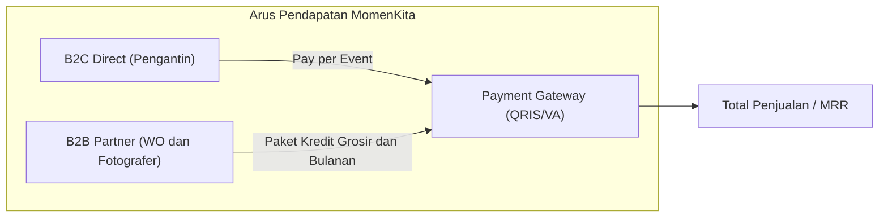
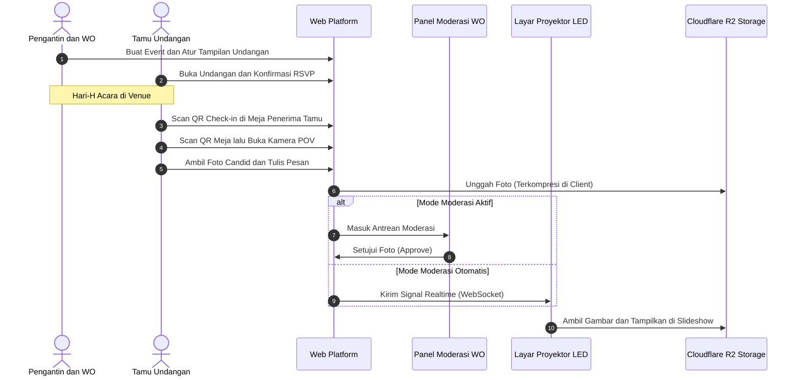
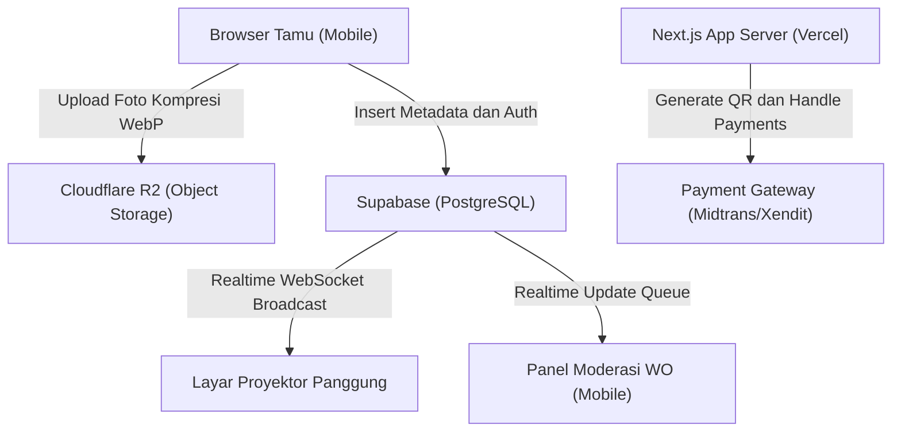
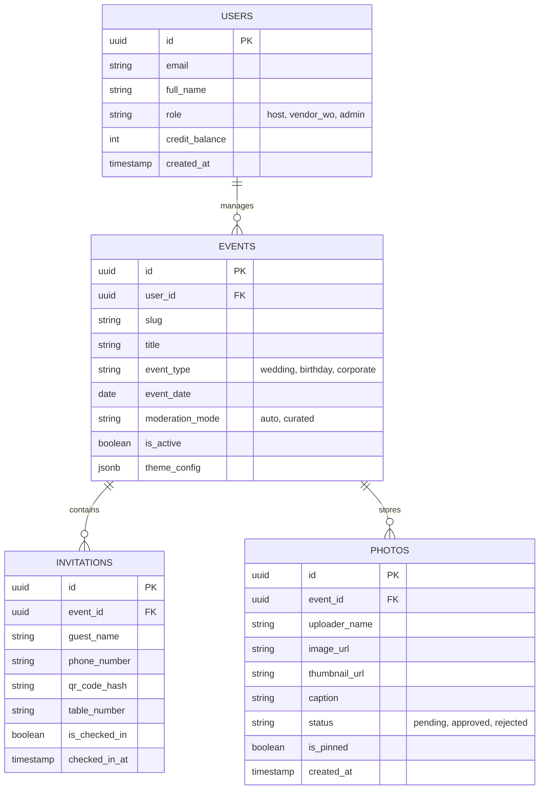
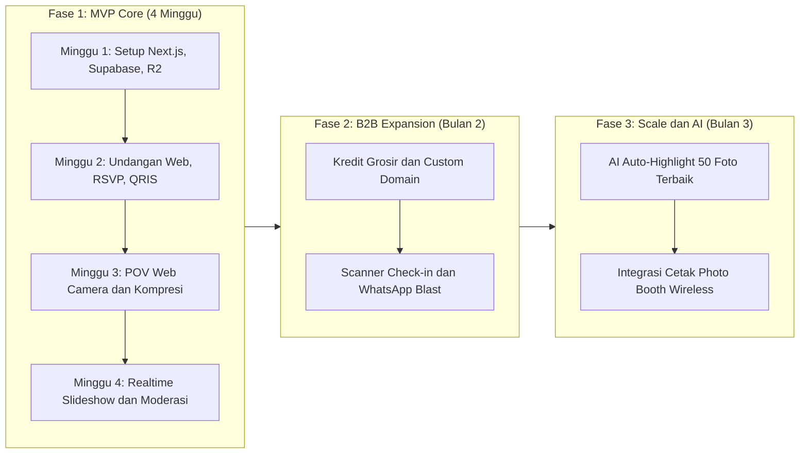

# Product Requirements Document (PRD)
# Platform: MomenKita (All-in-One Digital Invitation & Live Event Experience SaaS)

**Versi Dokumen:** 1.0.1  
**Tanggal:** 26 September 2026  
**Status:** Ready for Review / Engineering Kick-off  
**Penulis:** AI Product Strategy Specialist & Pair Architect  

---

## 1. Executive Summary & Visi Produk

### 1.1 Latar Belakang
Pasar undangan digital saat ini telah terkomoditisasi menjadi *red ocean*, di mana penyedia bersaing harga dengan menawarkan halaman web statis murah (Rp 20.000 – Rp 50.000). Di sisi lain, tren pernikahan dan acara modern sangat mementingkan **pengalaman tamu (*guest experience*)** dan **dokumentasi candid otentik** dari sudut pandang tamu (*Point of View / POV*), sebagaimana dibuktikan oleh popularitas platform seperti *Satualbum.id*, *Wedbox*, dan kamera *disposable*.

### 1.2 Pernyataan Visi Produk
**MomenKita** adalah platform SaaS *all-in-one event experience* yang menggabungkan:
1. **Pre-Event:** Undangan digital interaktif & manajemen RSVP cerdas.
2. **Reception Desk:** Buku tamu digital berbasis QR Code check-in.
3. **During Event:** Kamera POV tamu instan (*zero-install mobile web*) yang tersinkronisasi ke album bersama.
4. **Stage Entertainment:** *Live Slideshow* interaktif di layar LED / proyektor panggung dengan kontrol moderasi *real-time*.
5. **Post-Event:** Pengunduhan album resolusi tinggi dalam format ZIP dan arsip kenangan digital.

### 1.3 Unique Value Proposition (UVP)
* **Bagi Pengantin/Tuan Rumah:** Tidak sekadar menyebar undangan, tetapi mendapatkan ratusan foto candid otentik dan memeriahkan suasana pesta tanpa biaya fotografer ekstra.
* **Bagi Tamu:** Pengalaman seru tanpa ribet unduh aplikasi di App Store/Play Store (cukup scan QR di meja).
* **Bagi Wedding Organizer (WO) & Vendor:** Nilai tambah layanan premium dengan sistem *white-label* dan pendapatan bagi hasil/komisi.

---

## 2. Target Persona & Stakeholder

| Persona | Peran | Kebutuhan Utama | Rasa Frustrasi / Titik Sakit |
| :--- | :--- | :--- | :--- |
| **Calon Pengantin (B2C Host)** | Pengambil keputusan utama | Acara berkesan, tamu merasa terlibat, foto candid terkumpul rapi di satu tempat. | Foto candid tamu tercecer di WhatsApp/Instagram Story yang hilang setelah 24 jam. |
| **Tamu Undangan (Guest)** | Pengguna akhir kamera POV | Mudah diakses, tidak mau isi formulir pendaftaran akun rumit, ingin fotonya diapresiasi/tampil di layar. | Malas unduh aplikasi baru yang menghabiskan memori HP dan registrasi email/password. |
| **Wedding Organizer (B2B Partner)** | Operator acara & reseller | Pengaturan check-in tamu cepat tanpa antrean, kontrol penuh atas foto yang tayang di panggung. | Khawatir ada foto vulgar/kurang pantas tamu yang tidak sengaja tayang di depan keluarga besar. |
| **Fotografer / Dokumentasi** | Kolaborator | Akses mudah mengunduh seluruh hasil foto tamu untuk materi album dokumentasi tambahan. | Sulit mengumpulkan foto-foto dari HP tamu setelah acara selesai. |

---

## 3. Model Bisnis & Skema Monetisasi

Platform menerapkan model **Hybrid B2C (Pay-per-Event)** dan **B2B (Subscription / Wholesale Bulk Credits)**.

### 3.1 Paket B2C (Direct to Consumer)
* **Paket Classic (Rp 149.000):** Undangan Web Interaktif + RSVP + Navigasi Maps + Angpao Digital.
* **Paket Complete Experience (Rp 399.000) [Flagship]:** Seluruh fitur Classic + POV Guest Camera (hingga 1.000 foto) + Live Slideshow Proyektor + QR Check-in Buku Tamu + Simpan album 6 bulan.
* **Paket Unlimited Luxury (Rp 699.000):** Kuota foto tanpa batas + Custom Domain Pengantin (`budi-ani.love`) + Simpan album selamanya + Download Full RAW ZIP.

### 3.2 Paket Kemitraan B2B (Wedding Organizer & Studio)
* **Sistem Kredit Acara (Bulk Credits):**
  * Beli 5 Event Token: Diskon 30% (Rp 279.000 / event)
  * Beli 15 Event Token: Diskon 45% (Rp 219.000 / event)
* **Paket WO Pro Agency (Rp 1.490.000 / bulan):**
  * Akses 10 event per bulan.
  * Fitur *White-Label*: URL dan logo platform menggunakan identitas WO sendiri.
  * Dedicated Priority Support di hari-H.

---

## 4. Alur Kerja Sistem & Siklus Acara

---

## 5. Rincian Kebutuhan Fungsional (Feature Breakdown)

### 5.1 Modul 1: Undangan Web Interaktif & RSVP
* **Custom Builder Ringkas:** Pemilihan template tema (Modern, Minimalist, Adat, Rustic).
* **Manajemen Tamu & Link Khusus:** Generator link undangan personal per nama tamu (misal: `.../to/Bapak-Rudi`).
* **Fitur RSVP Interaktif:** Formulir konfirmasi kehadiran, jumlah orang, dan ucapan/doa.
* **Fitur Praktis:** Tombol "Tambahkan ke Kalender" (Google Calendar / iCal), navigasi Google Maps / Waze terintegrasi, dan amplop digital (rekening bank & QRIS).

### 5.2 Modul 2: Buku Tamu Digital & QR Check-in
* **QR Tiket Undangan:** Setiap undangan memiliki QR code unik yang dikirim via WhatsApp/halaman undangan.
* **Meja Resepsi Scanner:** Penerima tamu / panitia cukup membuka kamera HP atau scanner barcode untuk memindai QR tamu.
* **Informasi Meja Otomatis:** Saat di-scan, layar penerima tamu menampilkan nama tamu, kategori (VIP/Reguler), dan nomor meja yang dialokasikan.
* **Rekap Kehadiran Realtime:** Dashboard menampilkan statistik persentase kehadiran tamu secara langsung.

### 5.3 Modul 3: Guest POV Camera (Web PWA Tanpa Unduh)
* **Akses Zero-Friction:** Tamu cukup memindai QR code yang diletakkan di setiap meja resepsi. Halaman web langsung meminta izin kamera peramban (*HTML5 MediaDevices API*).
* **Identitas Minimalis:** Tamu hanya perlu memasukkan nama atau panggilan singkat sebelum memotret.
* **Antarmuka Kamera Nostalgia / Disposable:** Opsi filter warna estetik (Vintage, Clean Glow, Film Camera) untuk menambah daya tarik visual.
* **Kompresi Client-Side Otomatis:** Gambar dikompresi di browser (maksimal lebar 1920px, format WebP, bobot < 400KB) sebelum dikirim, memastikan upload lancar meski sinyal seluler di dalam gedung penuh sesak.

### 5.4 Modul 4: Live Projector Slideshow & Moderation Console
* **Tampilan Layar Lebar (Stage Display):**
  * Tampilan *fullscreen* responsif untuk proyektor dan layar LED panggung (16:9 / 21:9).
  * Menampilkan transisi mulus (*fade/slide*) saat foto baru diunggah.
  * Menampilkan kartu ucapan singkat dan nama pengunggah di pojok foto.
  * Tampilan QR Code di sudut layar agar tamu lain bisa ikut memindai dan mengunggah foto.
* **Panel Kontrol Moderasi (Host / WO Mobile Console):**
  * Pengaturan Mode: **"Auto-Publish"** (langsung tayang) atau **"Curated"** (wajib di-approve panitia).
  * Tindakan Cepat 1-Ketukan: Tombol *Approve*, *Reject*, dan *Pin to Top*.
  * Tombol *Emergency Blackout*: Menutup layar panggung sementara jika terjadi kendala teknis atau gangguan konten.

### 5.5 Modul 5: Post-Event Memory & Dashboard Ekspor
* **Galeri Bersama (Shared Cloud Album):** Halaman galeri yang bisa diakses oleh pengantin dan tamu setelah acara.
* **Unduh Seluruh Foto Sekali Klik (Bulk ZIP Export):** Pengantin dapat mengunduh seluruh file foto dalam satu arsip ZIP terkompresi.
* **Laporan Buku Tamu (PDF/Excel):** Ekspor daftar tamu yang hadir beserta catatan ucapan dan waktu check-in.

---

## 6. Arsitektur Teknologi & Efisiensi Biaya

Pilihan arsitektur dirancang agar **biaya operasional bulanan (OPEX) tetap mendekati nol** saat masa awal rilis, namun sanggup menahan ribuan transaksi bersamaan di hari Sabtu/Minggu.

| Komponen | Pilihan Teknologi | Alasan Pemilihan & Keunggulan |
| :--- | :--- | :--- |
| **Frontend & Framework** | Next.js (App Router), React, Tailwind CSS | SEO tinggi untuk halaman undangan publik, rendering cepat, performa mobile optimal. |
| **Database & Realtime** | Supabase (PostgreSQL + RLS + Realtime) | Mendukung integrasi WebSockets bawaan untuk sinkronisasi seketika foto ke proyektor tanpa setup server socket terpisah. |
| **Penyimpanan Media** | **Cloudflare R2 Storage** | **100% Bebas Biaya Egress (Bandwidth Keluar)**. Mencegah lonjakan tagihan cloud saat pengantin mengunduh ribuan foto. |
| **Payment Gateway** | Midtrans / Xendit | Mendukung metode pembayaran instan Indonesia (QRIS Dinamis, GoPay, ShopeePay, Virtual Account semua bank utama). |
| **Media Compression** | Browser-Image-Compression (Client Worker) | Kompresi gambar resolusi tinggi langsung di peramban pengguna sebelum upload, menghemat kuota tamu dan beban server. |

---

## 7. Skema Basis Data (Database Schema)

---

## 8. Persyaratan Non-Fungsional (Non-Functional Requirements)

1. **Kecepatan Live Stream (Latency):** Waktu antara foto selesai diunggah tamu hingga muncul di layar panggung maksimal **< 2 detik** (pada mode otomatis dengan koneksi 4G standar).
2. **Kesiapan Mobile (Mobile First):** Ukuran bundle JavaScript untuk kamera tamu maksimal **< 150KB** agar halaman langsung terbuka dalam waktu < 1 detik saat QR code di-scan.
3. **Privasi & Keamanan Konten:**
   * Setiap album acara dilindungi kode unik (*Event Passcode* opsional).
   * URL foto di-generate menggunakan *Signed URL* atau diproteksi oleh *Row-Level Security (RLS)* di Supabase.
4. **Reliabilitas Hari-H (High Availability):** Kemampuan menangani lonjakan *spike* lalu lintas pada jam pesta (pukul 11.00 - 14.00 WIB dan 18.00 - 21.00 WIB di akhir pekan).

---

## 9. Rencana Rilis MVP (Roadmap)

| Fase | Target Waktu | Fokus Utama | Deliverables |
| :--- | :--- | :--- | :--- |
| **Fase 1 (MVP)** | Minggu 1 - 4 | Core Experience | Undangan web, RSVP, QRIS, POV Camera web, Live Slideshow, Moderasi HP |
| **Fase 2 (B2B)** | Bulan ke-2 | Monetisasi WO | Sistem token kredit, White-label domain, Scanner check-in resepsi |
| **Fase 3 (Scale)**| Bulan ke-3 | Ekosistem & AI | Kurasi AI foto terbaik, Integrasi wireless photo printer |

---

## 10. Indikator Keberhasilan (Key Performance Indicators / KPI)

* **Metrik Finansial:** Mencapai transaksi 30 event berbayar di bulan pertama peluncuran (Target MRR: Rp 10.000.000 – Rp 15.000.000).
* **Metrik Adopsi Tamu:** Rata-rata 40% dari total tamu undangan yang hadir aktif mengambil minimal 2 foto POV.
* **Metrik Kemitraan B2B:** Mengakuisisi minimal 5 Wedding Organizer aktif sebagai mitra tetap dalam 60 hari pertama.
* **Metrik Viral Loop:** Rasio K-Factor > 1.2 (setiap 1 event yang berjalan mendatangkan minimal 1 calon pengantin baru yang mendaftar melalui branding link di layar proyektor).
